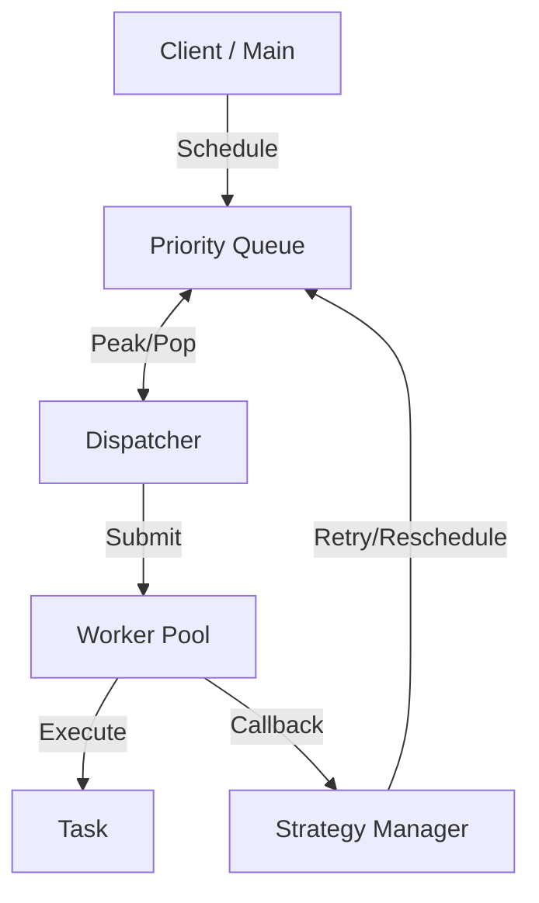

# Go Task Scheduler: Production-Grade & Modular

A high-performance, multi-threaded task scheduler built with Go, emphasizing **SOLID principles**, modular architecture, and a rich Terminal User Interface (TUI). This project is designed to handle thousands of concurrent tasks with various scheduling requirements while providing real-time visibility through a sophisticated dashboard.

## System Architecture

The project follows a decoupled, interface-driven architecture where each component has a single, well-defined responsibility.



### Core Components Deep-Dive

#### 1. Task Model (`internal/scheduler/task.go`)
The execution unit of the system.
- **`ITask` Interface**: Defines the contract for any executable unit (`Execute`, `OnSuccess`, `OnFailure`, etc.).
- **`BaseTask`**: A robust implementation supporting:
    - **Prioritization**: High-priority tasks move to the front of the queue.
    - **Immediate Execution**: Runs as soon as a worker is free.
    - **Delays**: Execution scheduled for a specific future timestamp.
    - **Periodicity**: Automatic rescheduling at fixed intervals.
    - **Retries**: Configurable limit with automatic backoff.

#### 2. Priority Queue (`internal/scheduler/queue.go`)
A thread-safe min-heap implementation.
- **Ordering**: Primarily by `ScheduledAt` (earliest first), and secondarily by `Priority` (highest first) for tasks scheduled at the same time.
- **Concurrency**: Guarded by a `sync.Mutex` to ensure safe access from the Dispatcher and Strategy Manager.

#### 3. Worker Pool (`internal/scheduler/pool.go`)
Manages the concurrent execution of tasks.
- **Fixed Scaling**: Uses a configurable number of worker goroutines.
- **Metrics Tracking**: Uses `sync/atomic` and `sync.RWMutex` to track worker states and task counts in real-time without bottlenecking performance.
- **Lifecycle Callbacks**: Triggers a completion callback after every execution to facilitate retries or rescheduling.

#### 4. Dispatcher (`internal/scheduler/dispatcher.go`)
The "clock" of the system.
- **Polling Loop**: Periodically checks the front of the queue.
- **Efficient Popping**: Only pops tasks that have reached their scheduled time, ensuring precise timing.
- **Decoupling**: It doesn't execute tasks; it merely moves them from the Queue to the Pool.

#### 5. Strategy Manager (`internal/scheduler/strategies.go`)
Centralizes the logic for task persistence and recovery.
- **Retries**: Applies an incremental backoff strategy (`retry_count * 100ms`).
- **Rescheduling**: Resets the `ScheduledAt` time for periodic tasks and pushes them back to the queue.

#### 6. Scheduler Facade (`internal/scheduler/engine.go`)
Provides a clean, unified API for the user, abstracting away the internal complexity of the queue, pool, and dispatcher.

---

## Premium Terminal UI (`cmd/scheduler/ui.go`)

The dashboard is built using the **Bubble Tea** (The Elm Architecture for Go) and **Lip Gloss** frameworks.

### Visual Components
- **Header**: High-contrast Nord-themed title with a live activity pulse.
- **Global Status Card**: Real-time aggregation of total, completed, and failed tasks.
- **Queue Monitor Card**: Displays the current "depth" of the priority queue and system load status.
- **Worker Cluster Card**: Shows the real-time activity of every individual worker goroutine, using **spinners** to indicate active processing.
- **System Activity Logs**: A scrollable, color-coded log viewport where:
    - `[SUCCESS]` events are Nord-Green.
    - `[FAILED]` events are Nord-Red.
    - `Worker` activity is Nord-Blue.
    - `Timestamps` are high-resolution `[HH:MM:SS.mmm]`.

### Design Philosophy
- **No Emojis**: Uses purely high-quality UTF-8 symbols (●, √, W1) for a clean, professional "Developer Tool" aesthetic.
- **Layout Stability**: Every panel has fixed dimensions and string padding to prevent flickering or layout shifting.
- **Nord Theme**: Adapted from the popular Nord color palette for maximum readability in dark terminals.

---

## SOLID Implementation Checklist

- **S - Single Responsibility**: Every file matches a component above (e.g., `pool.go` *only* manages workers).
- **O - Open/Closed**: New task types can be created by implementing `ITask` without changing the `Scheduler` logic.
- **L - Liskov Substitution**: `BaseTask` can be replaced by any `ITask` implementation.
- **I - Interface Segregation**: Clients only interact with the `ITask` or `TaskQueue` methods they need.
- **D - Dependency Inversion**: The `Scheduler` depends on the `TaskQueue` interface, not the concrete `PriorityQueue`.

---

## Project Structure

```bash
.
├── cmd/scheduler       # TUI and Demo Application
│   ├── main.go         # Entry point, log redirection
│   └── ui.go           # Bubble Tea dashboard implementation
├── internal/scheduler  # Core Library
│   ├── dispatcher.go   # Timing worker
│   ├── engine.go       # Facade
│   ├── interfaces.go   # Abstractions and Stats types
│   ├── pool.go         # Execution manager
│   ├── queue.go        # Thread-safe heap
│   ├── strategies.go   # Retry/Periodic logic
│   └── task.go         # Executable unit base
├── Makefile            # Build automation
├── .golangci.yml       # Linter configuration
└── README.md           # This comprehensive guide
```

---

## Getting Started

### Prerequisites
- Go 1.21+

### Running the Dashboard
The application requires running the entire package to include the UI components:
```bash
make run
# or
go run ./cmd/scheduler
```

### Running Tests
Fully verified with race detection:
```bash
make test
```

### Linting
```bash
make lint
```