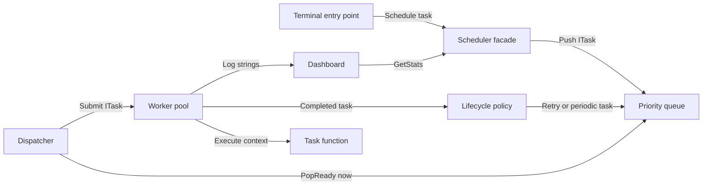
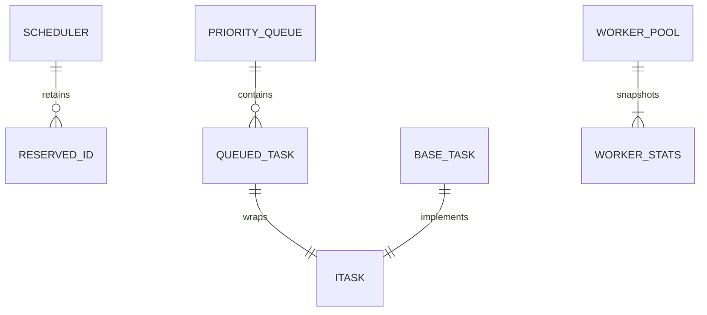
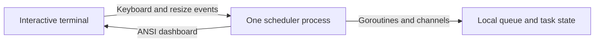

# Architecture

## Overview

The scheduler is one Go process with a facade coordinating a queue, a polling dispatcher and a worker pool. Completion feeds the same task back into the queue when its built-in policy requires another attempt; the terminal UI reads statistics and receives log strings ([engine.go:21](../../internal/scheduler/engine.go#L21), [main.go:18](../../cmd/scheduler/main.go#L18)).

## Components

| Component | Responsibility | Lives in | Talks to |
| --- | --- | --- | --- |
| Executable and dashboard | Configure sample work, display counters and logs, handle quit. | [cmd/scheduler/](../../cmd/scheduler), [inventory](03-structure.md#terminal-command) | Scheduler and Bubble Tea program. |
| Scheduler facade | Own lifecycle, validate submissions, retain unique IDs, aggregate stats. | [internal/scheduler/](../../internal/scheduler), [engine.go:9](../../internal/scheduler/engine.go#L9) | Queue, pool and dispatcher. |
| Queue | Serialize heap changes and atomically remove a due task. | [internal/scheduler/](../../internal/scheduler), [queue.go:44](../../internal/scheduler/queue.go#L44) | Facade, dispatcher and lifecycle handler. |
| Dispatcher | Poll every 100 ms, hand ready tasks to available workers. | [internal/scheduler/](../../internal/scheduler), [dispatcher.go:48](../../internal/scheduler/dispatcher.go#L48) | Queue and pool. |
| Worker pool | Bound active execution, recover execution panics, count attempts. | [internal/scheduler/](../../internal/scheduler), [pool.go:99](../../internal/scheduler/pool.go#L99) | Task methods and completion handler. |
| Task and lifecycle policy | Store mutable task status and compute the next due time. | [internal/scheduler/](../../internal/scheduler), [task.go:20](../../internal/scheduler/task.go#L20), [strategies.go:8](../../internal/scheduler/strategies.go#L8) | User function and queue. |

## Boundaries and contracts

- **Acceptance:** `Schedule(ITask) bool` transfers ownership; configure fields before calling it. IDs must be nonempty and unique for the scheduler's lifetime. BaseTask additionally requires a function and nonnegative interval/retry limit ([engine.go:74](../../internal/scheduler/engine.go#L74)). Negative delay is not rejected; it creates already-due work ([task.go:67](../../internal/scheduler/task.go#L67)).
- **Execution:** `ITask` supplies getters, `Execute(context.Context) error`, `OnSuccess` and `OnFailure`. Callbacks run synchronously in the worker; only `Execute` receives panic recovery ([interfaces.go:8](../../internal/scheduler/interfaces.go#L8), [pool.go:113](../../internal/scheduler/pool.go#L113)).
- **Queue:** `TaskQueue` exposes `Push`, `Pop`, `Peak` and `Len`, but does not express atomic ready removal. The dispatcher type-asserts the concrete `*PriorityQueue` for `PopReady`; other queue implementations use a separate peek/pop fallback ([interfaces.go:18](../../internal/scheduler/interfaces.go#L18), [dispatcher.go:67](../../internal/scheduler/dispatcher.go#L67)).
- **Pool:** An unbuffered channel makes submission wait for a worker or cancellation. `Submit` has no acceptance return value, so a task removed during shutdown can be discarded ([pool.go:33](../../internal/scheduler/pool.go#L33), [pool.go:82](../../internal/scheduler/pool.go#L82)).
- **Observation:** Worker snapshots are copied under a read lock and counters are atomic. The facade combines separate reads, so a `SchedulerStats` value is concurrency-safe but not a single atomic picture of all components ([pool.go:43](../../internal/scheduler/pool.go#L43), [engine.go:92](../../internal/scheduler/engine.go#L92)).

## Data model

These are in-memory relationships, not database tables; custom implementations can satisfy `ITask` ([interfaces.go:8](../../internal/scheduler/interfaces.go#L8)).

| Entity | Stored in | Key fields | Defined at |
| --- | --- | --- | --- |
| Scheduler | Process heap | Lifecycle flags, reserved IDs, done channel, context. | [engine.go:9](../../internal/scheduler/engine.go#L9) |
| BaseTask | Caller-created object transferred to scheduler | ID, priority, function, status, due time, interval, retry state, last error. | [task.go:20](../../internal/scheduler/task.go#L20) |
| Queued task | Heap slice | `ITask` and monotonically assigned enqueue sequence. | [queue.go:9](../../internal/scheduler/queue.go#L9) |
| WorkerStats / SchedulerStats | Copied values | Current task, worker status, queue depth, attempt counters. | [interfaces.go:25](../../internal/scheduler/interfaces.go#L25) |

## State and persistence

All queue entries, IDs, counters and task results are process-local; there is no durable journal or recovery path in the constructor ([engine.go:21](../../internal/scheduler/engine.go#L21)). Stop abandons queued work without clearing the heap or ID map; those objects can remain reachable while the scheduler itself remains referenced ([engine.go:58](../../internal/scheduler/engine.go#L58)). Dashboard logs retain only the latest 500 strings ([ui.go:126](../../cmd/scheduler/ui.go#L126)).

## Deployment

`make build` compiles one local binary; `main` hardcodes four workers and demonstration functions. There is no network listener, database setup or deployment manifest in this executable's startup path ([Makefile:5](../../Makefile#L5), [main.go:25](../../cmd/scheduler/main.go#L25)).

## Failure and scale

- **Task errors and execution panics:** Count as failed attempts and enter retry policy; custom getter/callback panics are outside the recovery boundary ([pool.go:113](../../internal/scheduler/pool.go#L113)).
- **Shutdown:** Cancellation unblocks pending submission and is passed to running functions; Stop waits for the worker goroutines. Functions that ignore cancellation delay or indefinitely block Stop ([engine.go:58](../../internal/scheduler/engine.go#L58), [pool.go:73](../../internal/scheduler/pool.go#L73)).
- **Scaling:** Worker count bounds execution concurrency, not queue size. The mutex-protected heap and single dispatcher are shared coordination points; separate processes do not share tasks or IDs ([queue.go:44](../../internal/scheduler/queue.go#L44), [dispatcher.go:62](../../internal/scheduler/dispatcher.go#L62), [pool.go:66](../../internal/scheduler/pool.go#L66)). No throughput target is claimed ([README.md:25](../../README.md#L25)).
