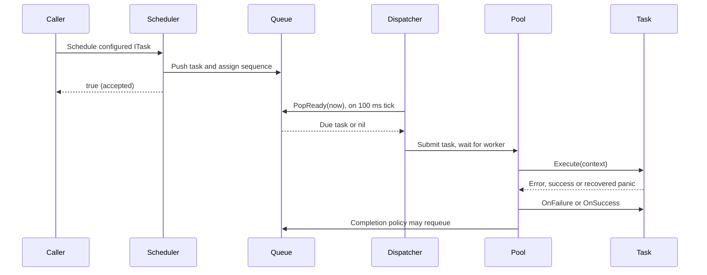
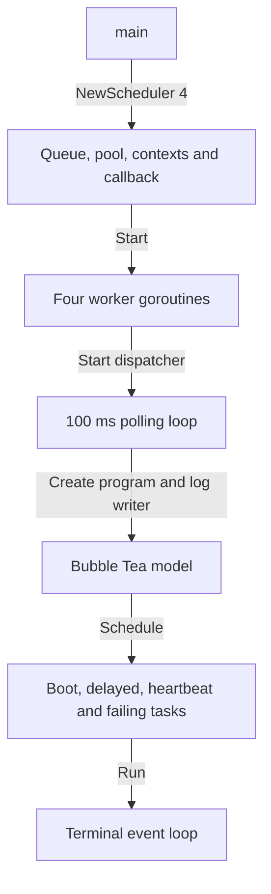
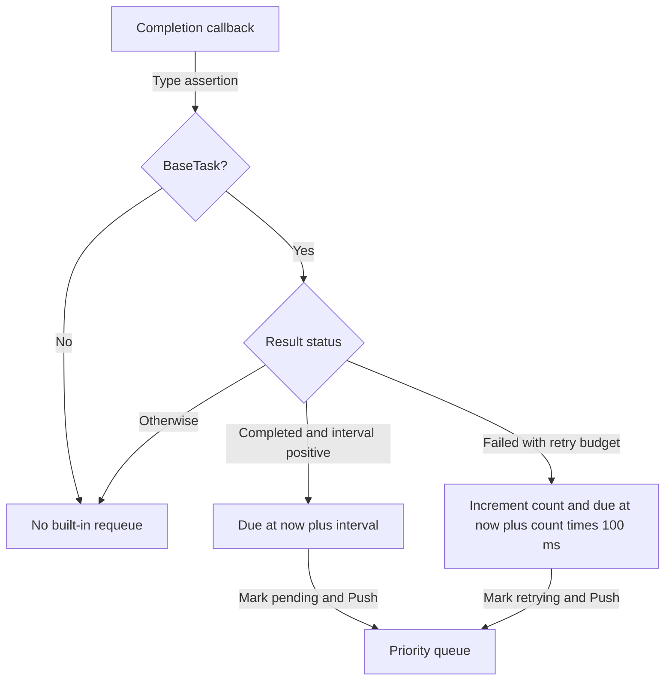
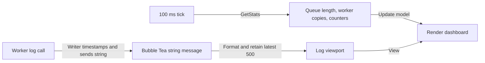
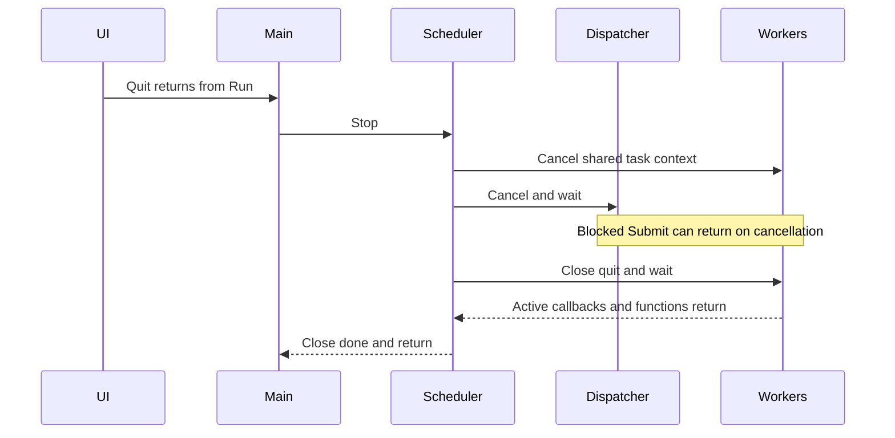
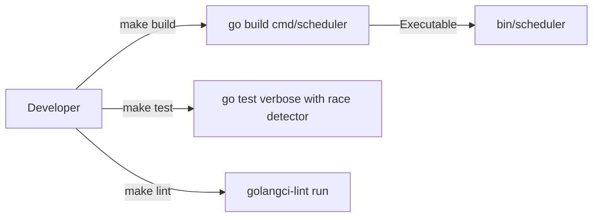

# Flow

## Scheduling and execution

1. **Configure and accept:** Create a BaseTask, optionally set delay/period/retries, and call `Schedule`. Rejected input returns false before enqueueing; accepted IDs remain reserved. Acceptance can precede Start ([task.go:32](../../internal/scheduler/task.go#L32), [engine.go:74](../../internal/scheduler/engine.go#L74)) · [structure](03-structure.md#scheduler-package).
2. **Order:** Queue Push wraps the task with a sequence. Earlier due time wins, then larger priority for equal times, then insertion order for equal time and priority ([queue.go:17](../../internal/scheduler/queue.go#L17), [queue.go:58](../../internal/scheduler/queue.go#L58)) · [structure](03-structure.md#scheduler-package).
3. **Dispatch:** Every 100 ms, the dispatcher repeatedly atomically removes tasks whose due time is no later than now. It stops draining when none are ready or its context is canceled. A custom queue uses the separate `Peak`/`Pop` path instead ([dispatcher.go:48](../../internal/scheduler/dispatcher.go#L48), [queue.go:92](../../internal/scheduler/queue.go#L92)) · [structure](03-structure.md#scheduler-package).
4. **Handoff:** Unbuffered Submit waits for an available worker, pool quit or scheduler cancellation; no extra runnable backlog lives in the channel ([pool.go:82](../../internal/scheduler/pool.go#L82)) · [structure](03-structure.md#scheduler-package).
5. **Execute:** A worker marks itself executing, calls `executeSafely`, invokes the success/failure callback and increments the matching attempt counter. The helper converts a panic from `Execute` into an error ([pool.go:113](../../internal/scheduler/pool.go#L113), [pool.go:141](../../internal/scheduler/pool.go#L141)) · [structure](03-structure.md#scheduler-package).
6. **Finish:** Worker status becomes idle, then the completion handler decides whether to enqueue the task again. There is no per-task result channel or synchronous completion return to the submitter ([pool.go:131](../../internal/scheduler/pool.go#L131), [engine.go:29](../../internal/scheduler/engine.go#L29)) · [structure](03-structure.md#scheduler-package).

Priority is queue selection order, not guaranteed completion order across workers. A task already removed while waiting for a worker is not reconsidered when a higher-priority task arrives ([dispatcher.go:68](../../internal/scheduler/dispatcher.go#L68), [pool.go:92](../../internal/scheduler/pool.go#L92)).

## Startup

1. **Wire:** `NewScheduler` clamps worker count to at least one, creates queue/pool/context and attaches `HandleTaskLifecycle` to pool completion ([engine.go:21](../../internal/scheduler/engine.go#L21)) · [structure](03-structure.md#scheduler-package).
2. **Start once:** Start guards its lifecycle flags, starts workers with the scheduler context, then starts the dispatcher with its own cancelable context ([engine.go:46](../../internal/scheduler/engine.go#L46), [dispatcher.go:19](../../internal/scheduler/dispatcher.go#L19)) · [structure](03-structure.md#scheduler-package).
3. **Configure terminal:** Main constructs the Bubble Tea program, redirects standard logging to `Program.Send`, submits eight demonstration tasks, and enters `Run` ([main.go:25](../../cmd/scheduler/main.go#L25)) · [structure](03-structure.md#terminal-command).
4. **Begin UI messages:** Model Init batches spinner activity with a 100 ms stats tick; a window-size event initializes its viewport ([ui.go:82](../../cmd/scheduler/ui.go#L82), [ui.go:100](../../cmd/scheduler/ui.go#L100)) · [structure](03-structure.md#terminal-command).

## Retry and periodic completion

1. **Record result:** BaseTask Execute marks running; the pool then calls OnSuccess or OnFailure, updating the task's status and last error on failure ([task.go:48](../../internal/scheduler/task.go#L48), [pool.go:121](../../internal/scheduler/pool.go#L121)) · [structure](03-structure.md#scheduler-package).
2. **Choose policy:** `HandleTaskLifecycle` returns for custom tasks. Completed BaseTasks with a positive interval reschedule relative to completion; failed BaseTasks retry only while `RetryCount < RetryLimit` ([strategies.go:8](../../internal/scheduler/strategies.go#L8)) · [structure](03-structure.md#scheduler-package).
3. **Requeue same object:** Periodic work becomes pending; retries increment the count and become retrying. Both push directly to the queue, bypassing Schedule's duplicate-ID gate. Successful completion does not reset the retry count ([strategies.go:17](../../internal/scheduler/strategies.go#L17), [task.go:58](../../internal/scheduler/task.go#L58)) · [structure](03-structure.md#scheduler-package).

## Dashboard observation

1. **Poll:** Each tick reads GetStats and schedules the next tick; the UI renders queue depth, workers and counters ([ui.go:115](../../cmd/scheduler/ui.go#L115), [engine.go:92](../../internal/scheduler/engine.go#L92)) · [command structure](03-structure.md#terminal-command), [scheduler structure](03-structure.md#scheduler-package).
2. **Stream logs:** `logWriter.Write` adds a timestamp and sends a string message. Update formats it, caps the log slice at 500 and scrolls to the bottom ([main.go:18](../../cmd/scheduler/main.go#L18), [ui.go:126](../../cmd/scheduler/ui.go#L126)) · [structure](03-structure.md#terminal-command).
3. **Render:** View composes cards and the viewport. “Total Tasks” is completed attempts plus failed attempts plus queue length; it is not a count of accepted unique IDs ([ui.go:138](../../cmd/scheduler/ui.go#L138)) · [structure](03-structure.md#terminal-command).

## Shutdown

1. **Quit:** `q` or Ctrl+C returns `tea.Quit`; normal program return calls `s.Stop`. A UI Run error exits the process before that Stop call ([ui.go:95](../../cmd/scheduler/ui.go#L95), [main.go:56](../../cmd/scheduler/main.go#L56)) · [structure](03-structure.md#terminal-command).
2. **Cancel:** Stop marks the scheduler stopped under its lock, cancels the worker context and releases the lock before waiting. Later Schedule calls return false; concurrent Stop calls wait on `done` ([engine.go:58](../../internal/scheduler/engine.go#L58)) · [structure](03-structure.md#scheduler-package).
3. **Wait:** Dispatcher Stop cancels and joins its loop; pool Stop closes quit once and waits for worker goroutines. Running tasks must return cooperatively; a task calling Stop on its own scheduler deadlocks by waiting on itself ([dispatcher.go:40](../../internal/scheduler/dispatcher.go#L40), [pool.go:73](../../internal/scheduler/pool.go#L73)) · [structure](03-structure.md#scheduler-package).
4. **Terminal state:** Close `done`; Start never restarts a stopped instance. Queued tasks and any lifecycle requeues during shutdown are abandoned ([engine.go:49](../../internal/scheduler/engine.go#L49), [engine.go:71](../../internal/scheduler/engine.go#L71), [strategies.go:8](../../internal/scheduler/strategies.go#L8)) · [structure](03-structure.md#scheduler-package).

## Build and verification

1. **Build/run:** Make builds `./cmd/scheduler` into `bin/scheduler` or invokes `go run` directly ([Makefile:5](../../Makefile#L5)) · [structure](03-structure.md#repository-root).
2. **Verify:** Make test runs the race detector across all packages; scheduler tests exercise integration, queue ordering and lifecycle behavior ([Makefile:8](../../Makefile#L8), [lifecycle_test.go:10](../../internal/scheduler/lifecycle_test.go#L10)) · [root structure](03-structure.md#repository-root), [scheduler structure](03-structure.md#scheduler-package).
3. **Lint:** Make invokes an externally installed golangci-lint with the repository linter list and five-minute timeout ([Makefile:14](../../Makefile#L14), [.golangci.yml:1](../../.golangci.yml#L1)) · [structure](03-structure.md#repository-root).
